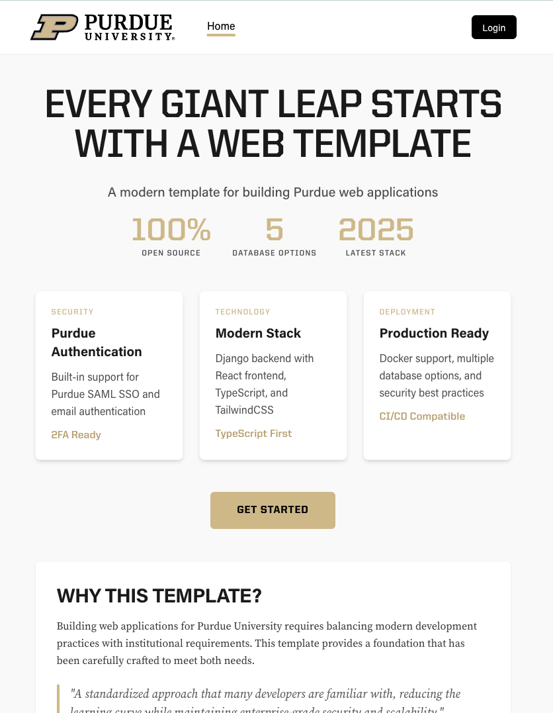

# Django React Template for Purdue Web Applications

A starter template for web applications that can be easily hosted and maintained at Purdue, with Purdue authentication and branding. This template combines [Django](https://www.djangoproject.com/) (Python backend) with [React](https://react.dev/) (JavaScript frontend), aiming to balance modern development practices with a standardized approach that many developers are familiar with.



**Note**: This is an early-stage template that will evolve based on feedback and real-world use.

## Overview

### For Decision Makers

This template provides:
- Pre-configured Purdue login integration (SAML/CAS)
- Purdue visual styling as a starting point
- Modern web development setup that many developers are familiar with
- A path to production requiring only a Python backend (no Node.js in production)
- Security best practices and production-ready configuration

### Technical Architecture

- **Backend**: Django (Python) - Handles authentication, database, APIs
- **Frontend**: React (TypeScript) - User interface, compiles to static files
- **Development**: Docker Compose for consistent local environment
- **Production**: Django serves both API and compiled React files

### Why This Approach?

**Pros:**
- Django's mature authentication system
- React for modern, interactive UIs
- Multi-database support out of the box
- Can migrate to other architectures if needs change
- No Node.js required in production (simpler deployment)

**Cons:**
- Not ideal for SEO or server-side rendering — Next.js (a React distribution) would support that at the cost of complexity

## Features

- **Django 5.1** backend with REST API
- **React 18** frontend with TypeScript
- **Multiple database support** (PostgreSQL, MySQL, MS SQL, Oracle, SQLite)
- **Dual authentication** modes (Purdue SAML SSO / Email)
- **TailwindCSS** with Purdue branding
- **Docker Compose** for development
- **Hot reloading** in development
- **Health checks** ensure services start in correct order
- **API documentation** with Swagger/OpenAPI
- **Production-ready** configuration

## Quick Start

### Prerequisites

- Docker Desktop (for `docker compose`)
- Git

### Getting Started

1. Clone the repository:
```bash
git clone https://github.itap.purdue.edu/wbbaker/django-react-template
cd django-react-template
```

2. Copy the environment file:
```bash
cp backend/.env.example backend/.env
```

3. Start the development environment:
```bash
docker compose up
```

For hot-reload testing with Gunicorn:
```bash
docker compose -f docker-compose.hot-reload.yml up
```

4. Access the application:
- Frontend: http://localhost:5173
- Backend API: http://localhost:8000/api
- API Documentation: http://localhost:8000/api/swagger/
- Django Admin: http://localhost:8000/admin/
- Redis: localhost:6379 (now included for caching/sessions)

### First-Time Setup

After starting the containers, run migrations and create a superuser:

```bash
docker compose exec backend python manage.py migrate
docker compose exec backend python manage.py createsuperuser
```

## Project Structure

```
django-react-template/
├── backend/                 # Django backend
│   ├── config/             # Django settings & configuration
│   │   ├── settings/       # Environment-specific settings
│   │   ├── urls.py        # URL configuration
│   │   └── wsgi.py        # WSGI configuration
│   ├── apps/              # Django applications
│   │   ├── authentication/ # Auth backends (SAML/Email)
│   │   ├── api/           # API endpoints
│   │   └── core/          # Core functionality
│   └── requirements/      # Python dependencies
├── frontend/              # React frontend
│   ├── src/              # Source code
│   │   ├── api/          # API client & hooks
│   │   ├── components/   # React components
│   │   ├── contexts/     # React contexts
│   │   ├── pages/        # Page components
│   │   └── styles/       # CSS files
│   └── package.json      # Node dependencies
├── compose.yml          # Development environment
└── docker-compose.hot-reload.yml  # Gunicorn hot-reload testing
```

## Configuration

### Database Selection

Set the `DATABASE_ENGINE` environment variable in `.env`:

- `postgresql` (recommended for production)
- `mysql` / `mariadb`
- `mssql` (MS SQL Server)
- `oracle`
- `sqlite` (template/development only)

#### Production Database Setup

When creating a real application from this template:

1. **Contact your database team** for database credentials
2. **Update `.env`** with the provided credentials:
   ```
   DATABASE_ENGINE=postgresql
   DB_NAME=your_app_db
   DB_HOST=db.server.edu
   DB_USER=your_app_user
   DB_PASSWORD=<provided_by_db_team>
   ```
3. **Run migrations**: `python manage.py migrate`

#### Migrating from SQLite to Production

1. Export data if needed: `python manage.py dumpdata > data.json`
2. Update `.env` with new database settings
3. Run migrations: `python manage.py migrate`
4. Import data if needed: `python manage.py loaddata data.json`

### Authentication Mode

Set the `AUTH_METHOD` environment variable:

- `email` - Email/password authentication (default for development)
- `saml` - Purdue SAML SSO (for production)

Both modes use the same API interface, making development easier.

### Environment Variables

Key environment variables (see `backend/.env.example` for full list):

```bash
# Django
SECRET_KEY=your-secret-key
DEBUG=True
AUTH_METHOD=email

# Database
DATABASE_ENGINE=postgresql
DB_NAME=purdue_app
DB_USER=postgres
DB_PASSWORD=postgres
DB_HOST=db
DB_PORT=5432

# CORS
CORS_ALLOWED_ORIGINS=http://localhost:5173
```

## Development

### Task Runner

This project includes a Taskfile for common development tasks. Install [Task](https://taskfile.dev/installation/) to use it:

```bash
# Run all linters
task lint

# Format code
task format

# Run tests
task test

# Run all checks before committing
task pre-commit

# View all available tasks
task --list
```

### Code Quality & Linting

The project uses automated code quality tools:

**Backend (Python):**
- **Black** - Code formatting
- **isort** - Import sorting
- **Flake8** - Linting
- **mypy** - Type checking

**Frontend (TypeScript/React):**
- **ESLint** - Linting and code quality
- **TypeScript** - Type checking

### Pre-commit Hooks (Optional)

Pre-commit hooks automatically check code quality before each commit. To enable them:

```bash
# Install pre-commit
pip install pre-commit

# Install the git hooks
pre-commit install

# Run hooks manually on all files
pre-commit run --all-files
```

Once installed, the hooks will run automatically on `git commit`. To skip hooks temporarily:
```bash
git commit --no-verify
```

### Backend Development

```bash
# Access Django shell
docker compose exec backend python manage.py shell

# Create new Django app
docker compose exec backend python manage.py startapp appname

# Make migrations
docker compose exec backend python manage.py makemigrations
docker compose exec backend python manage.py migrate

# Run tests
docker compose exec backend python manage.py test
```

### Frontend Development

```bash
# Install new package
docker compose exec frontend npm install package-name

# Run type checking
docker compose exec frontend npm run type-check

# Run linting
docker compose exec frontend npm run lint

# Run tests
docker compose exec frontend npm test
```

### Working Without Docker

If you prefer to work without Docker:

**Backend:**
```bash
cd backend
python -m venv venv
source venv/bin/activate  # On Windows: venv\Scripts\activate
pip install -r requirements/development.txt
python manage.py runserver
```

**Frontend:**
```bash
cd frontend
npm install
npm run dev
```

## Customization

### Adding Purdue SAML

1. Apply for SAML access through the [Purdue Authentication Options](https://www.purdue.edu/securepurdue/identity-access/authentication-options.php) page
2. Once approved, obtain SAML certificates and metadata URL from Purdue IT
3. Place certificates in `backend/saml/`
4. Update SAML settings in `.env`:
   ```bash
   AUTH_METHOD=saml
   SAML_ENTITY_ID=https://yourapp.purdue.edu/saml/metadata/
   SAML_METADATA_URL=https://www.purdue.edu/apps/account/saml/metadata.xml
   ```

### Modifying Purdue Branding

Edit the Tailwind configuration in `frontend/tailwind.config.js`:
- Update colors in `theme.extend.colors.purdue`
- Modify fonts in `theme.extend.fontFamily`

### Adding New API Endpoints

1. Create serializers in `backend/apps/api/serializers.py`
2. Create views in `backend/apps/api/views.py`
3. Register URLs in `backend/apps/api/urls.py`
4. Add TypeScript types in `frontend/src/api/`
5. Create React Query hooks for the endpoints

### Making It Your Own

TODO: Document the process for:
1. Forking this template
2. Renaming for your project
3. Setting up Purdue authentication
4. Basic customization steps

## Deployment

For complete deployment instructions, see [`deployment/README.md`](deployment/README.md).

### Quick Start

**Development/QA deployment:**
```bash
# Push to branch and auto-deploy (if GitOps is configured):
git push origin main  # or qa, production branches

# Manual deployment:
ssh server "cd ~/source/django-react-template && ./deployment/gitops-lite.sh"
```

**Local testing with production-like setup:**
```bash
docker compose -f docker-compose.hot-reload.yml up
```

See [`deployment/NEW-SERVER-SETUP.md`](deployment/NEW-SERVER-SETUP.md) for detailed server setup and production deployment instructions.

## Testing

The template includes example tests for both backend and frontend to help you get started.

### Running Tests

Using Task (recommended):
```bash
# Run all tests
task test

# Run backend tests only
task test:backend

# Run frontend tests only
task test:frontend

# Run with coverage
task test:backend:coverage
task test:frontend:coverage
```

Or using Docker directly:
```bash
# Backend tests (Django/pytest)
docker compose exec backend pytest -v

# Frontend tests (React/Vitest)
docker compose exec frontend npm test
```

### Test Examples

- **Backend**: See `backend/apps/api/test_example.py` for Django REST API testing patterns
- **Frontend**: See `frontend/src/components/*.test.tsx` for React component testing patterns

Both include examples of:
- Unit tests
- Authentication testing
- API endpoint testing
- Component rendering tests
- User interaction tests

## API Documentation

The API is documented using OpenAPI/Swagger. Access the documentation at:

- Swagger UI: http://localhost:8000/api/swagger/
- ReDoc: http://localhost:8000/api/redoc/
- OpenAPI Schema: http://localhost:8000/api/schema/

## Technology Stack

| Layer | Technology | Rationale |
|-------|------------|-----------|
| Backend API | Django 5.1+ | Mature, secure, good auth support |
| Frontend | React 18 + Vite | Popular, good developer experience |
| CSS | TailwindCSS | Utility-first, easy to customize |
| Database | PostgreSQL | Robust, widely supported |
| Dev Environment | Docker | Consistency across machines |

## Testing

### Backend Tests

```bash
docker compose exec backend python manage.py test
```

### Frontend Tests

```bash
docker compose exec frontend npm test
```

## Known Limitations

- No server-side rendering (affects SEO, initial load)
- Requires knowledge of both Python and JavaScript
- Still experimental, not battle-tested
- Limited mobile app support

## Future Options

This template doesn't lock you into specific choices. You could:
- Add server-side rendering with Next.js
- Replace React with another framework
- Split into microservices
- Add WebSocket support for real-time features

## Troubleshooting

### Database Connection Issues

If you see database connection errors:
1. Ensure the database service is running: `docker compose ps`
2. Check database credentials in `.env`
3. Verify the database engine matches your setup

### CORS Errors

If you encounter CORS errors:
1. Check `CORS_ALLOWED_ORIGINS` in `.env`
2. Ensure the frontend URL is included
3. Restart the backend service

### Authentication Issues

For SAML authentication problems:
1. Verify SAML certificates are in place
2. Check metadata URL is accessible
3. Ensure entity ID matches Purdue's configuration

## Resources

### Purdue-Specific
- [Purdue SAML/Authentication Documentation](https://www.purdue.edu/securepurdue/identity-access/authentication-options.php)
- [Purdue Visual Identity](https://marcom.purdue.edu/our-brand/visual-identity/)
- [Purdue IT Service Portal](https://service.purdue.edu/)
- Example applications (coming soon)

### Technologies
- [Django Documentation](https://docs.djangoproject.com/)
- [React Documentation](https://react.dev/)
- [Vite Documentation](https://vitejs.dev/)
- [Docker Compose](https://docs.docker.com/compose/)

## Contributing

1. Fork the repository
2. Create a feature branch
3. Make your changes
4. Run tests
5. Submit a pull request

## License

MIT License - See LICENSE file for details

## Support

This is an evolving template. For questions or suggestions:
- Contact the development team via Microsoft Teams (preferred)
- Email: wbbaker@purdue.edu, deshunz@purdue.edu, brooksa@purdue.edu
- Create an issue on [GitHub](https://github.itap.purdue.edu/wbbaker/django-react-template/issues)
- [Purdue IT Service Portal](https://service.purdue.edu/)

## Acknowledgments

- Purdue University IT for SAML integration support
- Django and React communities for excellent documentation
